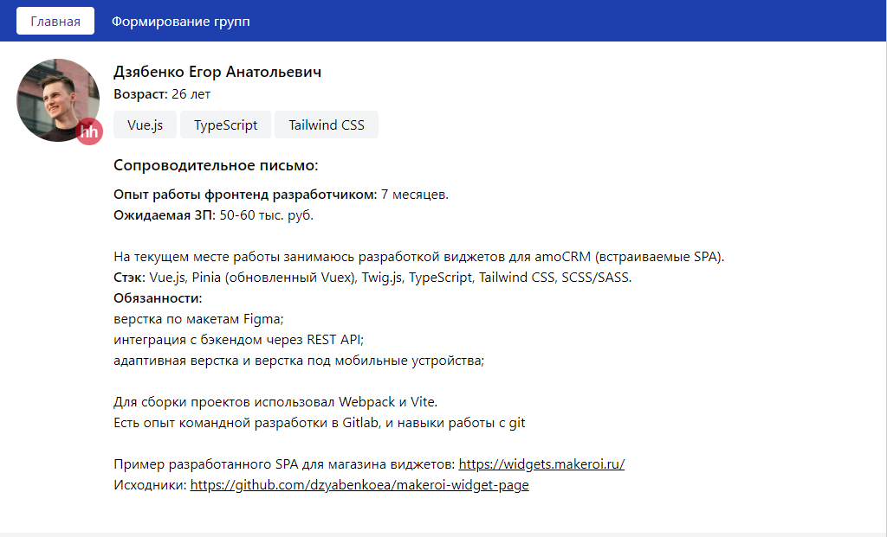
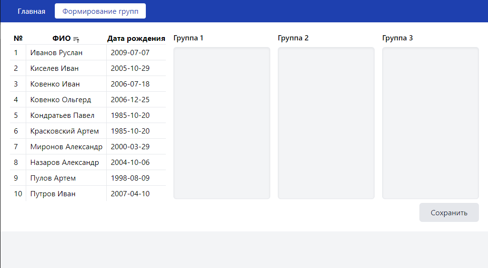
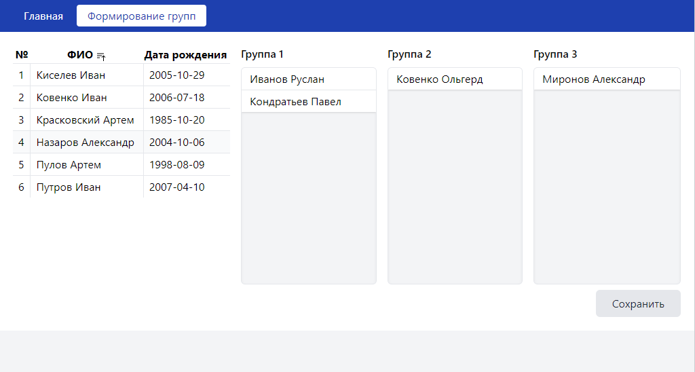
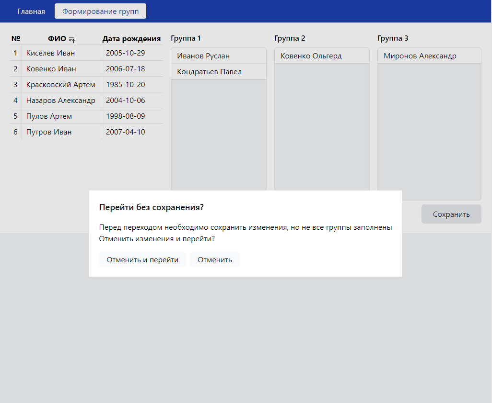
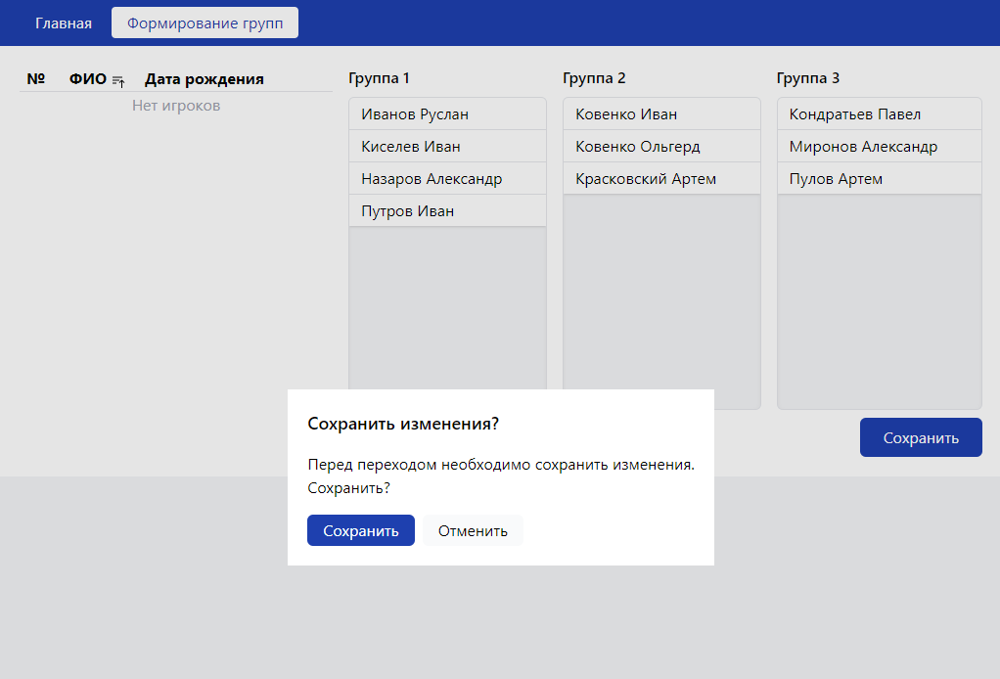
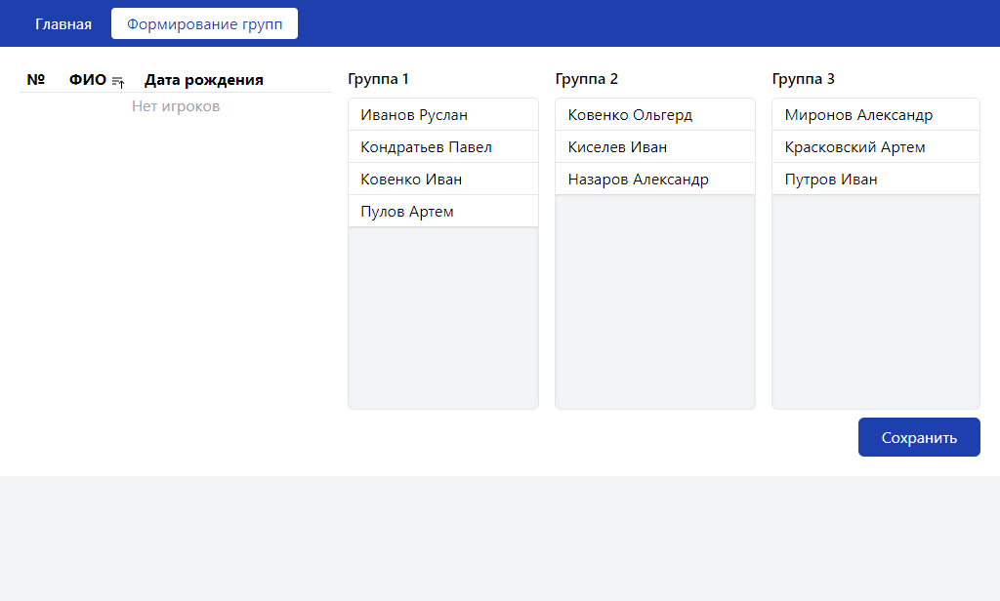
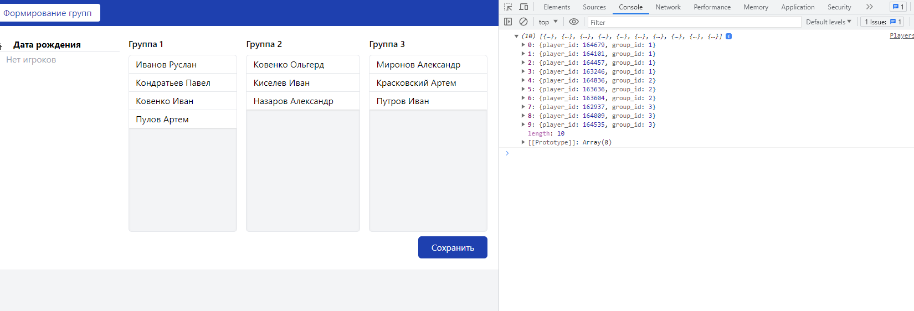

# Тестовое задание на вакансию Frontend-разработчик
## Главный экран

## Формирование групп

### Перемещение игроков

### Попытка перехода с незаполненными группами

### Попытка перехода с заполненными группами

### Доступность сохранения при заполненных группах

### Вывод результата в консоль

