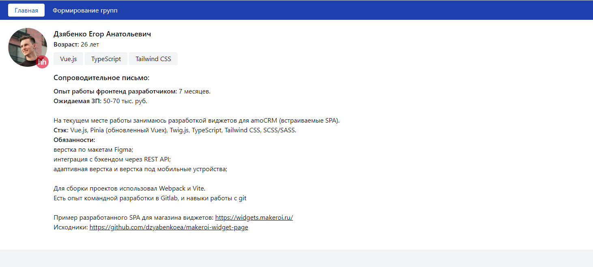

# Тестовое задание на вакансию Frontend-разработчик

## Задание

* Создать Vue JS v3.x  проект с добавление библиотеки vue router и добавить 2 страницы:
* Главная — содержит в себе информацию о вас (ту, которую посчитаете нужным)
* Формирование групп — содержит в себе функциональную задачу
* Выполнить функциональную задачу (см. описание ниже) с помощью фреймворка Vue JS, при необходимости можно использовать UI Kit библиотеку  PrimeVue
* Задокументировать написанный код (JSDoc)

Имеется список из «N» игроков (данные по игрокам записаны в переменной players), необходимо отрисовать его в табличном виде со следующими столбцами и сортировкой по ним:
* № (порядковый номер)
* ФИО
* Дата рождения

Распределение игроков по группам должно осуществляться последовательным выбором игроков с помощью двойного нажатия левой кнопкой мыши в списке игроков, при этом выбранный игрок из списка удаляется. Удаление из группы игрока должно осуществляться двойным нажатием на поле «Фамилия имя» в соответствующей группе. При удалении игрока из группы он должен попадать обратно в исходный список игроков согласно алфавитному порядку. Так же нужно учесть, что при удалении игрока, в группе освобождается место, и при добавлении из исходного списка какого-либо игрока, он должен заполнить это место, а уже затем заполняются остальные группы.

Добавить кнопку «Сохранить», повесить на нее обработчик событий, который выводит подготовленные данные для отправки на сервер, в консоль, а также добавить блокировку данной кнопки в случае неполного заполнения групп игроками. Предусмотреть блокировку перехода со страницы «Формирование групп» на страницу «Главная» в случае, если были внесены какие-либо изменение в составе групп. При попытке такого перехода, нужно выводить пользователю сообщение о том, что необходимо сохранить внесенные изменения. (Задача по желанию — вывод сообщение о необходимости сохранить внесенные изменения должен блокировать взаимодействия пользователя с остальным интерфейсом и дать пользователю возможность из этого сообщения нажать кнопку (Сохранить/Отменить), в случае сохранения, пользователя перебрасывает на страницу «Главная»).

## Главный экран

## Формирование групп

### Перемещение игроков

### Попытка перехода с незаполненными группами

### Попытка перехода с заполненными группами

### Доступность сохранения при заполненных группах

### Вывод результата в консоль

